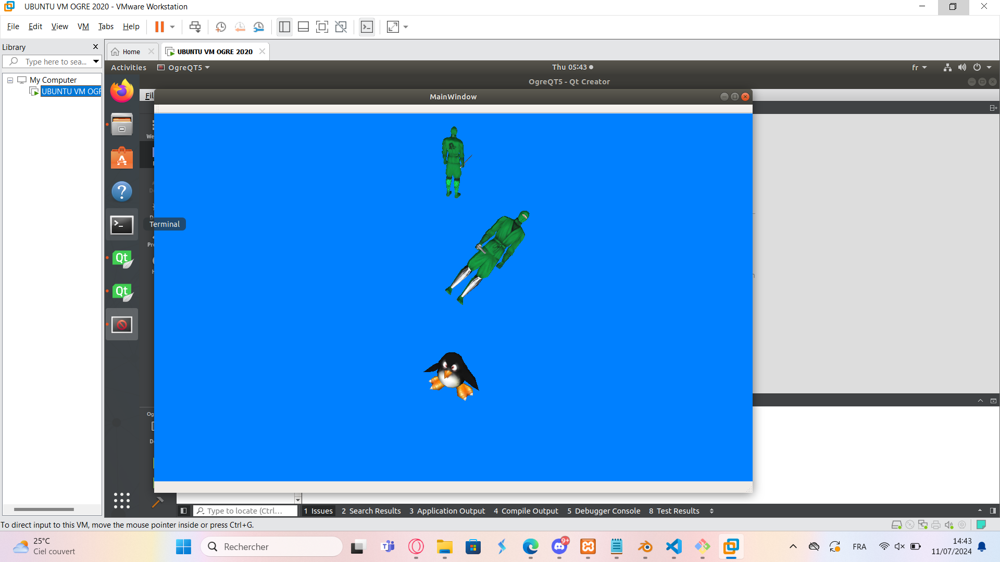
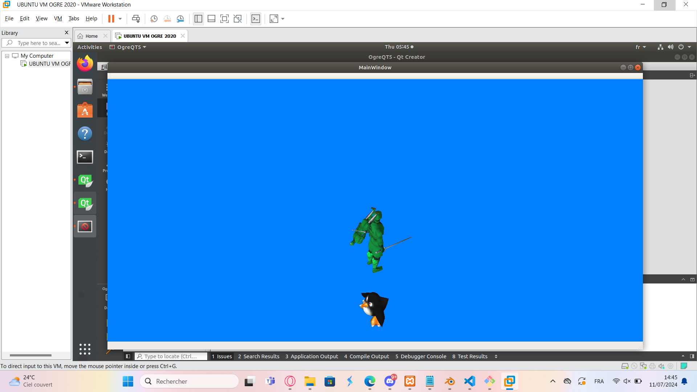
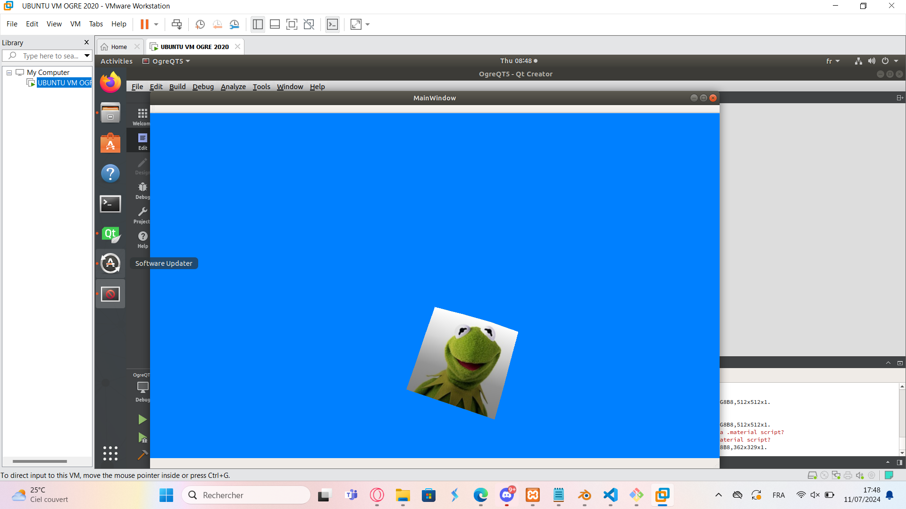
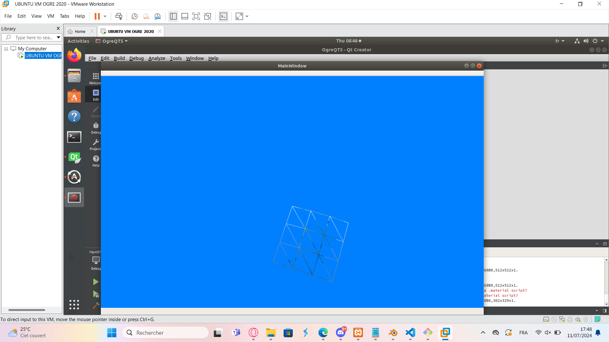

# Response au TP4-Ogre

## Point de validation n°1

`pourquoi le ninja disparait-il ?`

Le ninja disparait car le farplane est trop proche et donc il n'est pas affiché.

## Point de validation n°2

`Montrer la scène, interagir avec la souris, expliquer le visuel obtenu avec les interactions de rotation F,G,H,J,K,L.`

La scène est la suivante: 
La souris nous sert à bouger la camera dans la scéne, quand au touches :
- F: rotation Y anti-horaire
- G: rotation Y horaire
- H: rotation Z anti-horaire
- J: rotation Z horaire
- K: rotation X anti-horaire
- L: rotation X horaire

En resumé, appliquer une rotaion sur le pingouin applique aussi une rotation sur le grand ninga par rapport à la position du pingouin. Le petit ninja n'est pas affecté par les rotations, il n'a pas de lien de parenté ave le pingouin.

### Etape 3

```Changeons de cible Dans la méthode voidQTOgreWindow::createScene(), nous pouvons choisir quel nœud de scène sera affecté par les rotations effectuées avec les touches F,G,H,J,K,L : utilisez  cameraManager->setTarget(nœud_de_scene_cible); et constatez les différences de comportement.```

Tout les objets sont indepanants, ils ne sont pas liés entre eux.

Centrer sur le grand ninja:


Centrer sur le petit ninja:



## Point de validation n°3 et etape 4

```Nous avons 9 kermit, un sur chaque quad créé pour le terrain – A vous de faire en sorte que la texture soit appliquée globalement une fois sur le maillage.```

Vos trouverez les rendu ci dessous :
- 
- 